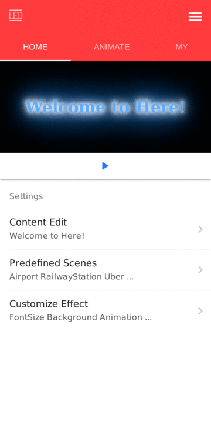

# iPlacard
用移动设备自定义和显示精美的接机牌；机场，车站接人和等车，演唱会等场景的好帮手～

## Project setup
```
npm install
```
>如果在中国，需要使用淘宝的npm registry，在npm install前执行：
`npm config set registry https://registry.npm.taobao.org`

### Compiles and hot-reloads for development
```
npm run serve
```

### Compiles and minifies for production
```
npm run build
```

### Compiles and minifies for production of Cordova
```
npm run cordova-build-android
```

### Build apk via Cordova
```
cd src-cordova
cordova build android --release
```

### Run apk via Cordova
```
cd src-cordova
cordova run android --release
```

### App's screenshots



